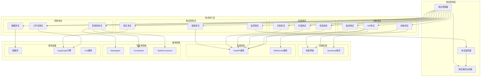
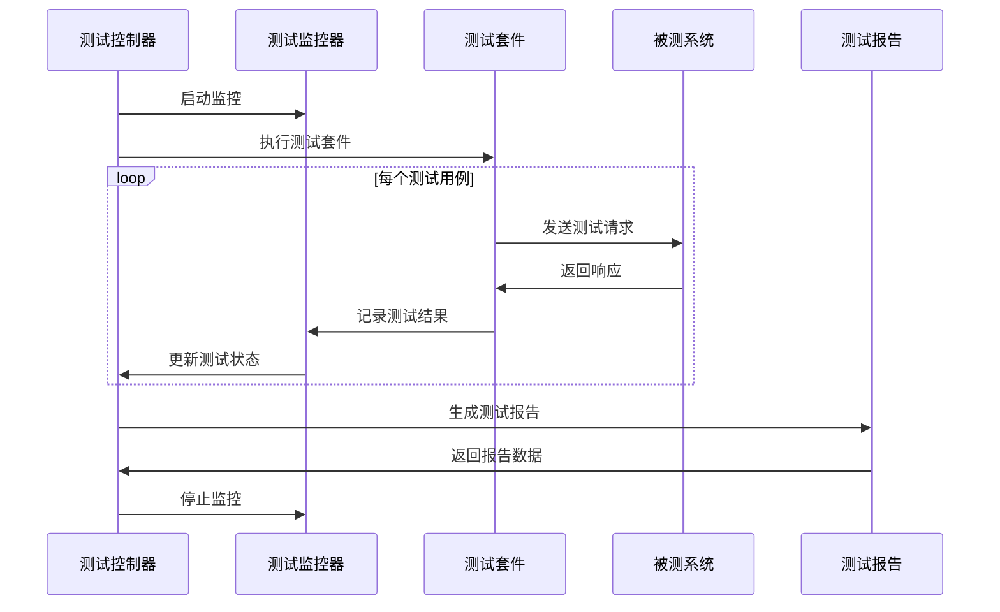

# 综合系统功能测试设计文档

## 概述

本设计文档描述了对LangGraph多智能体系统进行全面功能测试的架构和实施方案。测试系统采用分层测试架构，包含单元测试、集成测试、端到端测试和性能测试，通过自动化测试套件验证系统的完整性、可用性和性能表现。

## 架构

### 测试架构图



### 测试数据流



## 组件和接口

### 1. 测试控制器 (TestController)

负责协调和管理整个测试流程的核心组件。

```python
from typing import Dict, List, Any, Optional
from dataclasses import dataclass
from enum import Enum
import asyncio
import time

class TestStatus(Enum):
    PENDING = "pending"
    RUNNING = "running"
    PASSED = "passed"
    FAILED = "failed"
    SKIPPED = "skipped"

@dataclass
class TestResult:
    test_name: str
    status: TestStatus
    duration: float
    details: Optional[Dict[str, Any]] = None
    error_message: Optional[str] = None

class TestController:
    def __init__(self):
        self.test_suites: Dict[str, Any] = {}
        self.results: List[TestResult] = []
        self.start_time: Optional[float] = None
        self.end_time: Optional[float] = None
    
    async def run_comprehensive_test(self) -> Dict[str, Any]:
        """执行综合测试"""
        self.start_time = time.time()
        
        # 按优先级执行测试套件
        test_sequence = [
            ("health_check", self._run_health_check),
            ("frontend_tests", self._run_frontend_tests),
            ("api_tests", self._run_api_tests),
            ("agent_tests", self._run_agent_tests),
            ("workflow_tests", self._run_workflow_tests),
            ("integration_tests", self._run_integration_tests),
            ("performance_tests", self._run_performance_tests),
            ("data_tests", self._run_data_tests),
            ("error_recovery_tests", self._run_error_recovery_tests)
        ]
        
        for suite_name, test_func in test_sequence:
            try:
                print(f"🧪 执行测试套件: {suite_name}")
                suite_results = await test_func()
                self.results.extend(suite_results)
                
                # 检查是否有关键失败
                critical_failures = [r for r in suite_results 
                                   if r.status == TestStatus.FAILED and 
                                   suite_name in ["health_check", "api_tests"]]
                
                if critical_failures and suite_name == "health_check":
                    print(f"⚠️ 关键测试失败，跳过后续测试")
                    break
                    
            except Exception as e:
                error_result = TestResult(
                    test_name=f"{suite_name}_execution",
                    status=TestStatus.FAILED,
                    duration=0.0,
                    error_message=str(e)
                )
                self.results.append(error_result)
        
        self.end_time = time.time()
        return self._generate_summary()
    
    def _generate_summary(self) -> Dict[str, Any]:
        """生成测试摘要"""
        total_tests = len(self.results)
        passed_tests = len([r for r in self.results if r.status == TestStatus.PASSED])
        failed_tests = len([r for r in self.results if r.status == TestStatus.FAILED])
        skipped_tests = len([r for r in self.results if r.status == TestStatus.SKIPPED])
        
        total_duration = self.end_time - self.start_time if self.start_time and self.end_time else 0
        
        return {
            "summary": {
                "total_tests": total_tests,
                "passed": passed_tests,
                "failed": failed_tests,
                "skipped": skipped_tests,
                "success_rate": (passed_tests / total_tests * 100) if total_tests > 0 else 0,
                "total_duration": total_duration
            },
            "results": [
                {
                    "test_name": r.test_name,
                    "status": r.status.value,
                    "duration": r.duration,
                    "details": r.details,
                    "error_message": r.error_message
                }
                for r in self.results
            ]
        }
```

### 2. 健康检查测试套件 (HealthCheckSuite)

验证系统基础服务的可用性。

```python
import requests
import asyncio
from typing import List

class HealthCheckSuite:
    def __init__(self, base_url: str = "http://localhost:8000", 
                 frontend_url: str = "http://localhost:3000"):
        self.base_url = base_url
        self.frontend_url = frontend_url
    
    async def run_all_checks(self) -> List[TestResult]:
        """执行所有健康检查"""
        checks = [
            ("backend_health", self._check_backend_health),
            ("frontend_access", self._check_frontend_access),
            ("api_endpoints", self._check_api_endpoints),
            ("database_connection", self._check_database_connection),
            ("websocket_connection", self._check_websocket_connection)
        ]
        
        results = []
        for check_name, check_func in checks:
            start_time = time.time()
            try:
                success, details = await check_func()
                duration = time.time() - start_time
                
                result = TestResult(
                    test_name=check_name,
                    status=TestStatus.PASSED if success else TestStatus.FAILED,
                    duration=duration,
                    details=details
                )
                results.append(result)
                
            except Exception as e:
                duration = time.time() - start_time
                result = TestResult(
                    test_name=check_name,
                    status=TestStatus.FAILED,
                    duration=duration,
                    error_message=str(e)
                )
                results.append(result)
        
        return results
    
    async def _check_backend_health(self) -> tuple[bool, Dict[str, Any]]:
        """检查后端健康状态"""
        try:
            response = requests.get(f"{self.base_url}/health", timeout=5)
            return response.status_code == 200, {
                "status_code": response.status_code,
                "response_time": response.elapsed.total_seconds(),
                "content": response.json() if response.headers.get('content-type', '').startswith('application/json') else response.text
            }
        except Exception as e:
            return False, {"error": str(e)}
    
    async def _check_frontend_access(self) -> tuple[bool, Dict[str, Any]]:
        """检查前端访问"""
        try:
            response = requests.get(f"{self.frontend_url}/88.html", timeout=5)
            return response.status_code == 200, {
                "status_code": response.status_code,
                "content_length": len(response.content)
            }
        except Exception as e:
            return False, {"error": str(e)}
    
    async def _check_api_endpoints(self) -> tuple[bool, Dict[str, Any]]:
        """检查关键API端点"""
        endpoints = [
            "/api/v1/system/status",
            "/api/v1/agents",
            "/api/v1/tasks"
        ]
        
        results = {}
        all_success = True
        
        for endpoint in endpoints:
            try:
                response = requests.get(f"{self.base_url}{endpoint}", timeout=5)
                success = response.status_code == 200
                results[endpoint] = {
                    "success": success,
                    "status_code": response.status_code,
                    "response_time": response.elapsed.total_seconds()
                }
                if not success:
                    all_success = False
            except Exception as e:
                results[endpoint] = {"success": False, "error": str(e)}
                all_success = False
        
        return all_success, results
```

### 3. 前端测试套件 (FrontendTestSuite)

测试前端界面的功能和交互。

```python
from selenium import webdriver
from selenium.webdriver.common.by import By
from selenium.webdriver.support.ui import WebDriverWait
from selenium.webdriver.support import expected_conditions as EC
from selenium.webdriver.chrome.options import Options

class FrontendTestSuite:
    def __init__(self, frontend_url: str = "http://localhost:3000"):
        self.frontend_url = frontend_url
        self.driver = None
    
    async def run_all_tests(self) -> List[TestResult]:
        """执行所有前端测试"""
        # 设置Chrome选项
        chrome_options = Options()
        chrome_options.add_argument("--headless")  # 无头模式
        chrome_options.add_argument("--no-sandbox")
        chrome_options.add_argument("--disable-dev-shm-usage")
        
        try:
            self.driver = webdriver.Chrome(options=chrome_options)
            
            tests = [
                ("page_load", self._test_page_load),
                ("navigation", self._test_navigation),
                ("agent_management", self._test_agent_management),
                ("task_creation", self._test_task_creation),
                ("llm_configuration", self._test_llm_configuration)
            ]
            
            results = []
            for test_name, test_func in tests:
                start_time = time.time()
                try:
                    success, details = await test_func()
                    duration = time.time() - start_time
                    
                    result = TestResult(
                        test_name=f"frontend_{test_name}",
                        status=TestStatus.PASSED if success else TestStatus.FAILED,
                        duration=duration,
                        details=details
                    )
                    results.append(result)
                    
                except Exception as e:
                    duration = time.time() - start_time
                    result = TestResult(
                        test_name=f"frontend_{test_name}",
                        status=TestStatus.FAILED,
                        duration=duration,
                        error_message=str(e)
                    )
                    results.append(result)
            
            return results
            
        finally:
            if self.driver:
                self.driver.quit()
    
    async def _test_page_load(self) -> tuple[bool, Dict[str, Any]]:
        """测试页面加载"""
        try:
            self.driver.get(f"{self.frontend_url}/88.html")
            
            # 等待页面加载完成
            WebDriverWait(self.driver, 10).until(
                EC.presence_of_element_located((By.TAG_NAME, "body"))
            )
            
            # 检查页面标题
            title = self.driver.title
            
            # 检查关键元素是否存在
            key_elements = [
                "body",
                "head",
                "script"
            ]
            
            elements_found = {}
            for element in key_elements:
                try:
                    elem = self.driver.find_element(By.TAG_NAME, element)
                    elements_found[element] = True
                except:
                    elements_found[element] = False
            
            success = all(elements_found.values())
            
            return success, {
                "title": title,
                "url": self.driver.current_url,
                "elements_found": elements_found
            }
            
        except Exception as e:
            return False, {"error": str(e)}
```

### 4. API测试套件 (APITestSuite)

测试后端API的功能和性能。

```python
import aiohttp
import asyncio
from typing import Dict, Any, List

class APITestSuite:
    def __init__(self, base_url: str = "http://localhost:8000"):
        self.base_url = base_url
    
    async def run_all_tests(self) -> List[TestResult]:
        """执行所有API测试"""
        async with aiohttp.ClientSession() as session:
            tests = [
                ("system_endpoints", self._test_system_endpoints),
                ("agent_endpoints", self._test_agent_endpoints),
                ("task_endpoints", self._test_task_endpoints),
                ("websocket_endpoints", self._test_websocket_endpoints),
                ("error_handling", self._test_error_handling)
            ]
            
            results = []
            for test_name, test_func in tests:
                start_time = time.time()
                try:
                    success, details = await test_func(session)
                    duration = time.time() - start_time
                    
                    result = TestResult(
                        test_name=f"api_{test_name}",
                        status=TestStatus.PASSED if success else TestStatus.FAILED,
                        duration=duration,
                        details=details
                    )
                    results.append(result)
                    
                except Exception as e:
                    duration = time.time() - start_time
                    result = TestResult(
                        test_name=f"api_{test_name}",
                        status=TestStatus.FAILED,
                        duration=duration,
                        error_message=str(e)
                    )
                    results.append(result)
            
            return results
    
    async def _test_system_endpoints(self, session: aiohttp.ClientSession) -> tuple[bool, Dict[str, Any]]:
        """测试系统管理端点"""
        endpoints = [
            ("/", "GET"),
            ("/health", "GET"),
            ("/api/v1/system/status", "GET"),
            ("/api/v1/system/health", "GET"),
            ("/api/v1/system/metrics", "GET")
        ]
        
        results = {}
        all_success = True
        
        for endpoint, method in endpoints:
            try:
                async with session.request(method, f"{self.base_url}{endpoint}") as response:
                    success = response.status < 400
                    results[endpoint] = {
                        "success": success,
                        "status": response.status,
                        "method": method,
                        "response_time": 0  # aiohttp doesn't provide elapsed time directly
                    }
                    
                    if not success:
                        all_success = False
                        
            except Exception as e:
                results[endpoint] = {"success": False, "error": str(e)}
                all_success = False
        
        return all_success, results
    
    async def _test_task_endpoints(self, session: aiohttp.ClientSession) -> tuple[bool, Dict[str, Any]]:
        """测试任务管理端点"""
        # 测试任务创建
        task_data = {
            "title": "API测试任务",
            "description": "这是一个API测试任务",
            "task_type": "test",
            "priority": 1,
            "requirements": ["API测试"],
            "constraints": ["5分钟内完成"]
        }
        
        results = {}
        
        try:
            # 创建任务
            async with session.post(f"{self.base_url}/api/v1/tasks", json=task_data) as response:
                create_success = response.status == 200
                results["create_task"] = {
                    "success": create_success,
                    "status": response.status
                }
                
                if create_success:
                    task_response = await response.json()
                    task_id = task_response.get("task_id")
                    
                    if task_id:
                        # 查询任务
                        async with session.get(f"{self.base_url}/api/v1/tasks/{task_id}") as get_response:
                            get_success = get_response.status == 200
                            results["get_task"] = {
                                "success": get_success,
                                "status": get_response.status
                            }
            
            # 获取任务列表
            async with session.get(f"{self.base_url}/api/v1/tasks") as response:
                list_success = response.status == 200
                results["list_tasks"] = {
                    "success": list_success,
                    "status": response.status
                }
            
            all_success = all(r.get("success", False) for r in results.values())
            return all_success, results
            
        except Exception as e:
            return False, {"error": str(e)}
```

### 5. 性能测试套件 (PerformanceTestSuite)

测试系统的性能和负载能力。

```python
import asyncio
import aiohttp
import time
from statistics import mean, median

class PerformanceTestSuite:
    def __init__(self, base_url: str = "http://localhost:8000"):
        self.base_url = base_url
    
    async def run_all_tests(self) -> List[TestResult]:
        """执行所有性能测试"""
        tests = [
            ("response_time", self._test_response_time),
            ("concurrent_requests", self._test_concurrent_requests),
            ("load_test", self._test_load_capacity),
            ("memory_usage", self._test_memory_usage)
        ]
        
        results = []
        for test_name, test_func in tests:
            start_time = time.time()
            try:
                success, details = await test_func()
                duration = time.time() - start_time
                
                result = TestResult(
                    test_name=f"performance_{test_name}",
                    status=TestStatus.PASSED if success else TestStatus.FAILED,
                    duration=duration,
                    details=details
                )
                results.append(result)
                
            except Exception as e:
                duration = time.time() - start_time
                result = TestResult(
                    test_name=f"performance_{test_name}",
                    status=TestStatus.FAILED,
                    duration=duration,
                    error_message=str(e)
                )
                results.append(result)
        
        return results
    
    async def _test_response_time(self) -> tuple[bool, Dict[str, Any]]:
        """测试响应时间"""
        endpoints = [
            "/health",
            "/api/v1/system/status",
            "/api/v1/agents",
            "/api/v1/tasks"
        ]
        
        response_times = {}
        
        async with aiohttp.ClientSession() as session:
            for endpoint in endpoints:
                times = []
                
                # 执行10次请求测量响应时间
                for _ in range(10):
                    start = time.time()
                    try:
                        async with session.get(f"{self.base_url}{endpoint}") as response:
                            await response.read()
                            end = time.time()
                            if response.status == 200:
                                times.append(end - start)
                    except:
                        pass
                
                if times:
                    response_times[endpoint] = {
                        "avg": mean(times),
                        "median": median(times),
                        "min": min(times),
                        "max": max(times),
                        "count": len(times)
                    }
        
        # 判断性能是否合格（平均响应时间小于5秒）
        success = all(
            rt.get("avg", float('inf')) < 5.0 
            for rt in response_times.values()
        )
        
        return success, response_times
    
    async def _test_concurrent_requests(self) -> tuple[bool, Dict[str, Any]]:
        """测试并发请求处理能力"""
        concurrent_levels = [5, 10, 20]
        results = {}
        
        async with aiohttp.ClientSession() as session:
            for level in concurrent_levels:
                start_time = time.time()
                
                # 创建并发任务
                tasks = []
                for _ in range(level):
                    task = self._make_request(session, "/health")
                    tasks.append(task)
                
                # 等待所有任务完成
                responses = await asyncio.gather(*tasks, return_exceptions=True)
                
                end_time = time.time()
                total_time = end_time - start_time
                
                # 统计成功率
                successful = sum(1 for r in responses if isinstance(r, dict) and r.get("success", False))
                success_rate = successful / level * 100
                
                results[f"concurrent_{level}"] = {
                    "total_requests": level,
                    "successful_requests": successful,
                    "success_rate": success_rate,
                    "total_time": total_time,
                    "requests_per_second": level / total_time if total_time > 0 else 0
                }
        
        # 判断并发性能是否合格（成功率大于90%）
        success = all(
            r.get("success_rate", 0) > 90 
            for r in results.values()
        )
        
        return success, results
    
    async def _make_request(self, session: aiohttp.ClientSession, endpoint: str) -> Dict[str, Any]:
        """发送单个请求"""
        try:
            start = time.time()
            async with session.get(f"{self.base_url}{endpoint}") as response:
                end = time.time()
                return {
                    "success": response.status == 200,
                    "status": response.status,
                    "response_time": end - start
                }
        except Exception as e:
            return {
                "success": False,
                "error": str(e)
            }
```

## 数据模型

### 测试配置模型

```python
from pydantic import BaseModel
from typing import Dict, List, Optional, Any

class TestConfiguration(BaseModel):
    """测试配置"""
    base_url: str = "http://localhost:8000"
    frontend_url: str = "http://localhost:3000"
    timeout: int = 30
    max_retries: int = 3
    parallel_execution: bool = True
    
    # 性能测试配置
    performance_thresholds: Dict[str, float] = {
        "max_response_time": 5.0,
        "min_success_rate": 90.0,
        "max_memory_usage": 1024  # MB
    }
    
    # 测试数据配置
    test_data: Dict[str, Any] = {
        "sample_task": {
            "title": "测试任务",
            "description": "这是一个测试任务",
            "task_type": "test",
            "priority": 1
        }
    }

class TestEnvironment(BaseModel):
    """测试环境"""
    name: str
    configuration: TestConfiguration
    services: List[str]
    dependencies: List[str]
    
class TestPlan(BaseModel):
    """测试计划"""
    name: str
    description: str
    environment: TestEnvironment
    test_suites: List[str]
    execution_order: List[str]
    parallel_suites: List[str] = []
```

## 错误处理

### 测试错误分类和处理策略

```python
from enum import Enum

class TestErrorType(Enum):
    SETUP_ERROR = "setup_error"
    EXECUTION_ERROR = "execution_error"
    ASSERTION_ERROR = "assertion_error"
    TIMEOUT_ERROR = "timeout_error"
    NETWORK_ERROR = "network_error"
    SYSTEM_ERROR = "system_error"

class TestErrorHandler:
    def __init__(self, max_retries: int = 3):
        self.max_retries = max_retries
        self.error_strategies = {
            TestErrorType.NETWORK_ERROR: self._handle_network_error,
            TestErrorType.TIMEOUT_ERROR: self._handle_timeout_error,
            TestErrorType.SYSTEM_ERROR: self._handle_system_error
        }
    
    async def handle_error(self, error: Exception, error_type: TestErrorType, 
                          test_context: Dict[str, Any]) -> Dict[str, Any]:
        """处理测试错误"""
        handler = self.error_strategies.get(error_type, self._handle_generic_error)
        return await handler(error, test_context)
    
    async def _handle_network_error(self, error: Exception, 
                                  context: Dict[str, Any]) -> Dict[str, Any]:
        """处理网络错误"""
        retry_count = context.get("retry_count", 0)
        
        if retry_count < self.max_retries:
            await asyncio.sleep(2 ** retry_count)  # 指数退避
            return {
                "action": "retry",
                "retry_count": retry_count + 1,
                "delay": 2 ** retry_count
            }
        else:
            return {
                "action": "fail",
                "reason": "网络连接失败，超过最大重试次数"
            }
    
    async def _handle_timeout_error(self, error: Exception, 
                                  context: Dict[str, Any]) -> Dict[str, Any]:
        """处理超时错误"""
        return {
            "action": "fail",
            "reason": "请求超时，可能系统负载过高",
            "suggestion": "检查系统资源使用情况"
        }
```

## 测试策略

### 1. 分层测试策略

- **单元测试层**: 测试独立组件功能
- **集成测试层**: 测试组件间协作
- **系统测试层**: 测试完整系统功能
- **验收测试层**: 测试用户场景

### 2. 测试执行策略

- **并行执行**: 独立测试并行运行
- **顺序执行**: 有依赖关系的测试顺序执行
- **条件执行**: 根据前置条件决定是否执行
- **失败快速停止**: 关键测试失败时停止后续测试

### 3. 测试数据策略

- **静态测试数据**: 预定义的测试数据
- **动态测试数据**: 运行时生成的测试数据
- **数据隔离**: 每个测试使用独立的数据
- **数据清理**: 测试完成后清理测试数据

### 4. 报告生成策略

- **实时报告**: 测试执行过程中实时更新
- **详细报告**: 包含所有测试细节和错误信息
- **摘要报告**: 提供高层次的测试结果概览
- **多格式输出**: 支持JSON、HTML、PDF等格式

这个设计文档提供了一个全面的测试架构，涵盖了系统的所有主要功能模块，通过分层测试和多种测试策略确保系统的质量和可靠性。