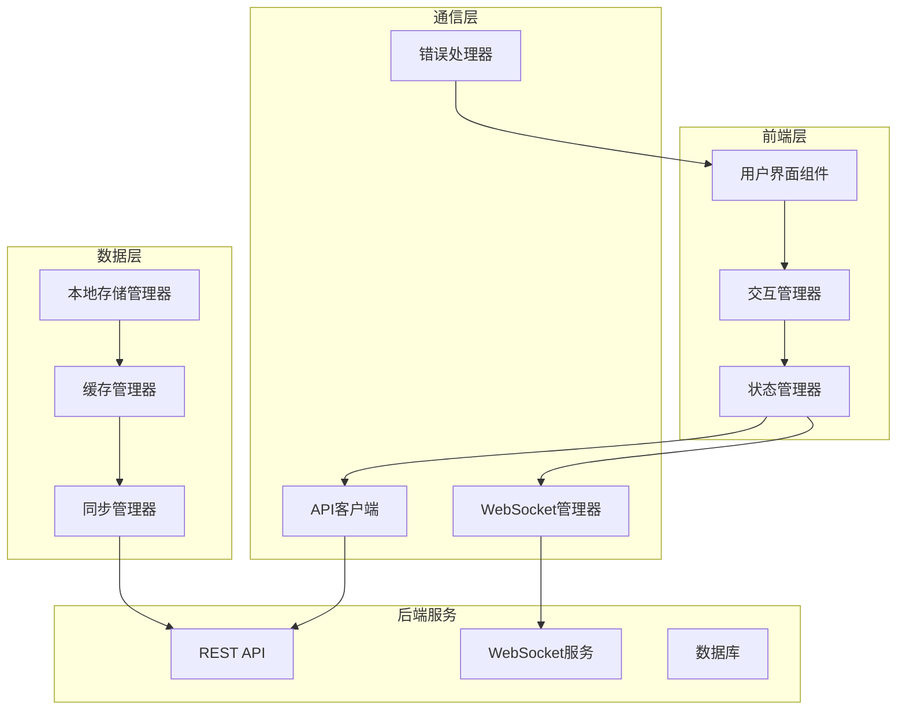
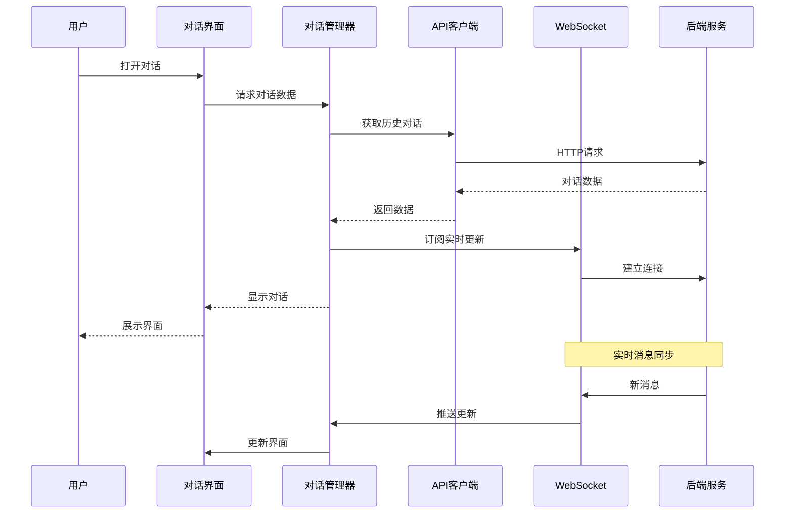
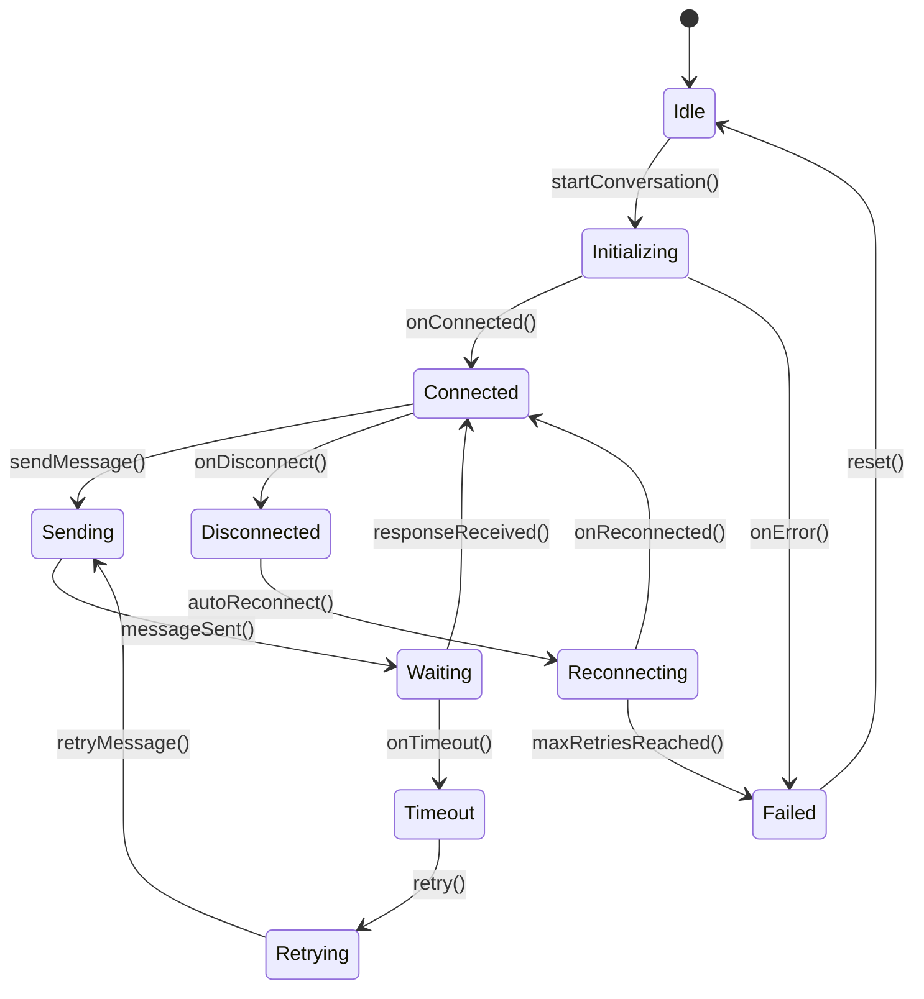
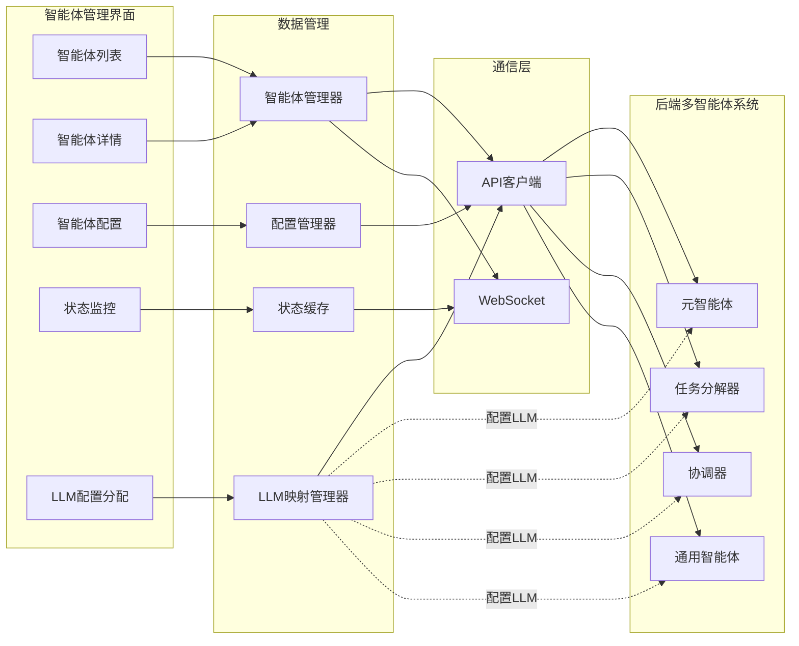
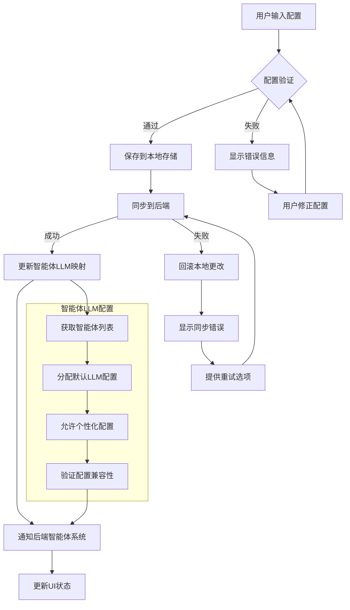

# 前端交互问题修复设计文档

## 概述

本设计文档基于需求分析，提供了修复前端系统中关键交互问题的详细技术方案。通过分析现有代码和问题根因，设计了一套完整的解决方案来修复时光回音对话、元智能体交互、智能体管理、大模型配置保存和任务依赖关系等功能。

## 架构设计

### 整体架构



### 核心组件设计

#### 1. 统一状态管理器 (StateManager)
- **职责**: 管理应用全局状态，提供状态订阅和更新机制
- **特性**: 
  - 响应式状态更新
  - 状态持久化
  - 状态回滚机制
  - 冲突检测和解决

#### 2. 增强的API客户端 (EnhancedAPIClient)
- **职责**: 处理所有HTTP请求，提供统一的错误处理和重试机制
- **特性**:
  - 自动重试机制
  - 请求队列管理
  - 响应缓存
  - 离线支持

#### 3. 实时通信管理器 (RealtimeManager)
- **职责**: 管理WebSocket连接和实时数据同步
- **特性**:
  - 连接状态监控
  - 消息队列和重传
  - 数据完整性保证
  - 自动重连机制

#### 4. 交互修复管理器 (InteractionFixManager)
- **职责**: 专门处理各种交互问题的修复
- **特性**:
  - 问题检测和诊断
  - 自动修复机制
  - 用户反馈收集
  - 修复状态跟踪

## 后端多智能体系统集成设计

### LLM配置与智能体映射

#### 设计原则
1. **统一配置管理**: 前端作为LLM配置的统一管理中心
2. **默认配置继承**: 后端智能体默认使用前端配置的主LLM
3. **个性化配置**: 支持为不同智能体配置专用LLM
4. **配置同步**: 确保前后端配置实时同步

#### 智能体LLM映射管理器

```javascript
class AgentLLMMapper {
    constructor() {
        this.defaultLLMConfig = null;
        this.agentLLMMap = new Map();
        this.supportedAgentTypes = [
            'meta_agent',
            'task_decomposer', 
            'coordinator',
            'generic'
        ];
    }
    
    async initializeMapping() {
        // 1. 获取默认LLM配置
        this.defaultLLMConfig = await this.getActiveLLMConfig();
        
        // 2. 获取所有后端智能体
        const agents = await this.getBackendAgents();
        
        // 3. 为每个智能体分配LLM配置
        for (const agent of agents) {
            await this.assignLLMToAgent(agent.id, this.defaultLLMConfig);
        }
        
        // 4. 同步到后端
        await this.syncToBackend();
    }
    
    async assignLLMToAgent(agentId, llmConfig) {
        // 为特定智能体分配LLM配置
        this.agentLLMMap.set(agentId, {
            llmConfig,
            assignedAt: new Date().toISOString(),
            status: 'pending'
        });
        
        // 通知后端更新智能体配置
        await this.updateBackendAgentLLM(agentId, llmConfig);
    }
    
    async updateBackendAgentLLM(agentId, llmConfig) {
        try {
            const response = await window.apiClient.put(
                `/api/v1/agents/${agentId}/llm-config`,
                {
                    llmConfig: {
                        provider: llmConfig.provider,
                        model: llmConfig.settings.model,
                        apiKey: llmConfig.settings.apiKey,
                        baseUrl: llmConfig.settings.baseUrl,
                        parameters: {
                            temperature: llmConfig.settings.temperature,
                            maxTokens: llmConfig.settings.maxTokens,
                            timeout: llmConfig.settings.timeout
                        }
                    }
                }
            );
            
            if (response.success) {
                const mapping = this.agentLLMMap.get(agentId);
                mapping.status = 'active';
                mapping.lastUpdated = new Date().toISOString();
            }
            
            return response;
        } catch (error) {
            console.error(`更新智能体 ${agentId} LLM配置失败:`, error);
            throw error;
        }
    }
}
```

#### 智能体类型与LLM配置策略

```javascript
const AgentLLMStrategy = {
    meta_agent: {
        name: '元智能体',
        recommendedModels: ['gpt-4', 'claude-3-opus', 'qwen-max'],
        defaultParameters: {
            temperature: 0.7,
            maxTokens: 4096
        },
        capabilities: ['reasoning', 'planning', 'analysis']
    },
    
    task_decomposer: {
        name: '任务分解器',
        recommendedModels: ['gpt-3.5-turbo', 'claude-3-sonnet', 'qwen-plus'],
        defaultParameters: {
            temperature: 0.3,
            maxTokens: 2048
        },
        capabilities: ['decomposition', 'structuring', 'dependency_analysis']
    },
    
    coordinator: {
        name: '协调器',
        recommendedModels: ['gpt-3.5-turbo', 'claude-3-haiku', 'qwen-turbo'],
        defaultParameters: {
            temperature: 0.1,
            maxTokens: 1024
        },
        capabilities: ['scheduling', 'resource_allocation', 'monitoring']
    },
    
    generic: {
        name: '通用智能体',
        recommendedModels: ['gpt-3.5-turbo', 'claude-3-haiku', 'qwen-turbo'],
        defaultParameters: {
            temperature: 0.5,
            maxTokens: 2048
        },
        capabilities: ['execution', 'reporting', 'basic_reasoning']
    }
};
```

### 智能体管理界面增强

#### 智能体LLM配置组件

```javascript
class AgentLLMConfigComponent {
    constructor(agentId, agentType) {
        this.agentId = agentId;
        this.agentType = agentType;
        this.availableLLMs = [];
        this.currentLLM = null;
        this.strategy = AgentLLMStrategy[agentType];
    }
    
    async render() {
        return `
            <div class="agent-llm-config">
                <h3>LLM配置 - ${this.strategy.name}</h3>
                
                <div class="current-config">
                    <label>当前LLM配置:</label>
                    <select id="llm-select-${this.agentId}">
                        <option value="default">使用默认配置</option>
                        ${this.renderLLMOptions()}
                    </select>
                </div>
                
                <div class="recommended-models">
                    <label>推荐模型:</label>
                    <div class="model-tags">
                        ${this.strategy.recommendedModels.map(model => 
                            `<span class="model-tag">${model}</span>`
                        ).join('')}
                    </div>
                </div>
                
                <div class="parameters">
                    <label>参数配置:</label>
                    <div class="parameter-grid">
                        <div class="parameter-item">
                            <label>Temperature:</label>
                            <input type="range" min="0" max="2" step="0.1" 
                                   value="${this.strategy.defaultParameters.temperature}">
                        </div>
                        <div class="parameter-item">
                            <label>Max Tokens:</label>
                            <input type="number" min="1" max="8192" 
                                   value="${this.strategy.defaultParameters.maxTokens}">
                        </div>
                    </div>
                </div>
                
                <div class="actions">
                    <button onclick="this.testLLMConnection()">测试连接</button>
                    <button onclick="this.saveLLMConfig()">保存配置</button>
                    <button onclick="this.resetToDefault()">重置为默认</button>
                </div>
                
                <div class="status">
                    <span class="status-indicator ${this.getStatusClass()}"></span>
                    <span class="status-text">${this.getStatusText()}</span>
                </div>
            </div>
        `;
    }
    
    async testLLMConnection() {
        // 测试智能体LLM连接
        const testResult = await window.apiClient.post(
            `/api/v1/agents/${this.agentId}/test-llm`,
            { testMessage: 'Hello, this is a connection test.' }
        );
        
        this.showTestResult(testResult);
    }
    
    async saveLLMConfig() {
        // 保存智能体LLM配置
        const config = this.collectConfigData();
        const result = await window.agentLLMMapper.assignLLMToAgent(
            this.agentId, 
            config
        );
        
        this.showSaveResult(result);
    }
}
```

## 组件详细设计

### 1. 时光回音对话修复

#### 问题分析
- 对话数据加载失败
- 消息更新不及时
- 历史记录丢失
- 状态同步问题

#### 解决方案

```javascript
class TimeEchoDialogFixer {
    constructor() {
        this.dialogCache = new Map();
        this.syncManager = new DialogSyncManager();
        this.stateManager = new DialogStateManager();
    }
    
    async fixDialogLoading() {
        // 修复对话加载问题
        // 1. 检查缓存
        // 2. 重试机制
        // 3. 降级处理
    }
    
    async fixMessageSync() {
        // 修复消息同步问题
        // 1. WebSocket重连
        // 2. 消息队列处理
        // 3. 状态一致性检查
    }
}
```

#### 数据流设计



### 2. 元智能体对话交互修复

#### 问题分析
- 对话会话初始化失败
- 消息发送无响应
- 进度状态不更新
- 连接中断处理不当

#### 解决方案

```javascript
class MetaAgentChatFixer {
    constructor() {
        this.sessionManager = new ChatSessionManager();
        this.messageQueue = new MessageQueue();
        this.progressTracker = new ProgressTracker();
    }
    
    async fixSessionInitialization() {
        // 修复会话初始化
        // 1. 验证API连接
        // 2. 重置会话状态
        // 3. 重新初始化
    }
    
    async fixMessageHandling() {
        // 修复消息处理
        // 1. 消息队列管理
        // 2. 超时处理
        // 3. 错误恢复
    }
}
```

#### 状态机设计



### 3. 智能体管理界面修复

#### 问题分析
- 智能体状态加载失败
- 详情模态框无响应
- 配置修改不生效
- 实时状态更新中断

#### 解决方案

```javascript
class AgentManagementFixer {
    constructor() {
        this.agentCache = new AgentCache();
        this.statusMonitor = new AgentStatusMonitor();
        this.configValidator = new ConfigValidator();
    }
    
    async fixAgentLoading() {
        // 修复智能体加载
        // 1. 缓存策略
        // 2. 批量加载
        // 3. 错误处理
    }
    
    async fixModalInteraction() {
        // 修复模态框交互
        // 1. 事件绑定检查
        // 2. DOM状态修复
        // 3. 数据同步
    }
}
```

#### 组件交互设计



### 4. 大模型配置保存修复

#### 问题分析
- 配置验证失败
- 保存操作无响应
- 本地存储同步问题
- 配置丢失风险
- 后端智能体LLM配置不同步

#### 解决方案

```javascript
class LLMConfigFixer {
    constructor() {
        this.configValidator = new LLMConfigValidator();
        this.storageManager = new ConfigStorageManager();
        this.syncManager = new ConfigSyncManager();
        this.agentLLMMapper = new AgentLLMMapper();
    }
    
    async fixConfigValidation() {
        // 修复配置验证
        // 1. 实时验证
        // 2. 错误提示
        // 3. 自动修正
    }
    
    async fixConfigSaving() {
        // 修复配置保存
        // 1. 事务处理
        // 2. 冲突解决
        // 3. 备份恢复
        // 4. 同步到后端智能体系统
    }
    
    async syncAgentLLMConfigs() {
        // 同步智能体LLM配置
        // 1. 获取所有智能体列表
        // 2. 为每个智能体分配LLM配置
        // 3. 更新后端智能体配置
        // 4. 验证配置生效
    }
}
```

#### 配置管理流程



### 5. 任务依赖关系交互修复

#### 问题分析
- 依赖关系创建失败
- 循环依赖检测不工作
- 可视化显示问题
- 状态更新延迟

#### 解决方案

```javascript
class TaskDependencyFixer {
    constructor() {
        this.dependencyGraph = new DependencyGraph();
        this.visualizer = new DependencyVisualizer();
        this.validator = new DependencyValidator();
    }
    
    async fixDependencyCreation() {
        // 修复依赖创建
        // 1. 图结构验证
        // 2. 循环检测
        // 3. 批量操作
    }
    
    async fixVisualization() {
        // 修复可视化
        // 1. 渲染优化
        // 2. 交互响应
        // 3. 数据同步
    }
}
```

#### 依赖关系数据模型

```javascript
class DependencyModel {
    constructor() {
        this.nodes = new Map(); // 任务节点
        this.edges = new Map(); // 依赖边
        this.metadata = new Map(); // 元数据
    }
    
    addDependency(fromTask, toTask, type = 'blocks') {
        // 添加依赖关系
        // 1. 验证节点存在
        // 2. 检查循环依赖
        // 3. 更新图结构
    }
    
    detectCycles() {
        // 循环依赖检测
        // 使用DFS算法检测环
    }
    
    getExecutionOrder() {
        // 获取执行顺序
        // 拓扑排序
    }
}
```

## 错误处理策略

### 错误分类和处理

```javascript
const ErrorHandlingStrategy = {
    // 网络错误
    network: {
        detection: () => !navigator.onLine || fetch_timeout,
        recovery: [
            'showOfflineMode',
            'enableRetryMechanism',
            'cacheFailedRequests'
        ]
    },
    
    // API错误
    api: {
        detection: (response) => response.status >= 400,
        recovery: [
            'parseErrorMessage',
            'showUserFriendlyError',
            'enableRetryWithBackoff'
        ]
    },
    
    // 状态同步错误
    sync: {
        detection: () => localState !== remoteState,
        recovery: [
            'detectConflicts',
            'showConflictResolution',
            'mergeStates'
        ]
    },
    
    // UI交互错误
    ui: {
        detection: () => element.disabled || !element.onclick,
        recovery: [
            'rebindEventHandlers',
            'resetComponentState',
            'refreshComponent'
        ]
    }
};
```

### 自动修复机制

```javascript
class AutoFixManager {
    constructor() {
        this.fixStrategies = new Map();
        this.fixHistory = [];
        this.preventionRules = [];
    }
    
    async detectAndFix(errorType, context) {
        // 1. 问题检测
        const issues = await this.detectIssues(errorType, context);
        
        // 2. 选择修复策略
        const strategy = this.selectFixStrategy(issues);
        
        // 3. 执行修复
        const result = await this.executeFix(strategy, context);
        
        // 4. 验证修复效果
        const verification = await this.verifyFix(result);
        
        // 5. 记录修复历史
        this.recordFix(errorType, strategy, result, verification);
        
        return verification;
    }
}
```

## 性能优化设计

### 1. 懒加载和代码分割

```javascript
// 动态导入组件
const loadComponent = async (componentName) => {
    const module = await import(`./components/${componentName}.js`);
    return module.default;
};

// 路由级别的代码分割
const routes = {
    '/agents': () => import('./pages/AgentManagement.js'),
    '/tasks': () => import('./pages/TaskManagement.js'),
    '/config': () => import('./pages/Configuration.js')
};
```

### 2. 缓存策略

```javascript
class CacheManager {
    constructor() {
        this.memoryCache = new Map();
        this.storageCache = new StorageCache();
        this.cachePolicy = new CachePolicy();
    }
    
    async get(key, options = {}) {
        // 1. 检查内存缓存
        if (this.memoryCache.has(key)) {
            return this.memoryCache.get(key);
        }
        
        // 2. 检查存储缓存
        const cached = await this.storageCache.get(key);
        if (cached && !this.isExpired(cached, options.ttl)) {
            this.memoryCache.set(key, cached.data);
            return cached.data;
        }
        
        // 3. 缓存未命中，返回null
        return null;
    }
}
```

### 3. 虚拟滚动

```javascript
class VirtualScrollList {
    constructor(container, itemHeight, renderItem) {
        this.container = container;
        this.itemHeight = itemHeight;
        this.renderItem = renderItem;
        this.visibleItems = [];
        this.scrollTop = 0;
    }
    
    render(data) {
        const containerHeight = this.container.clientHeight;
        const startIndex = Math.floor(this.scrollTop / this.itemHeight);
        const endIndex = Math.min(
            startIndex + Math.ceil(containerHeight / this.itemHeight) + 1,
            data.length
        );
        
        // 只渲染可见项
        this.visibleItems = data.slice(startIndex, endIndex);
        this.updateDOM();
    }
}
```

## 测试策略

### 1. 单元测试

```javascript
describe('InteractionFixManager', () => {
    let fixManager;
    
    beforeEach(() => {
        fixManager = new InteractionFixManager();
    });
    
    test('should detect dialog loading issues', async () => {
        const mockError = new Error('Dialog loading failed');
        const result = await fixManager.detectIssue('dialog_loading', mockError);
        
        expect(result.detected).toBe(true);
        expect(result.type).toBe('dialog_loading');
    });
    
    test('should fix API connection issues', async () => {
        const mockContext = { endpoint: '/api/v1/agents', error: 'timeout' };
        const result = await fixManager.fixAPIConnection(mockContext);
        
        expect(result.success).toBe(true);
        expect(result.strategy).toBe('retry_with_backoff');
    });
});
```

### 2. 集成测试

```javascript
describe('Frontend Integration', () => {
    test('should handle complete user workflow', async () => {
        // 1. 用户登录
        await userLogin();
        
        // 2. 加载智能体列表
        const agents = await loadAgents();
        expect(agents.length).toBeGreaterThan(0);
        
        // 3. 创建新任务
        const task = await createTask({
            title: 'Test Task',
            description: 'Integration test task'
        });
        expect(task.id).toBeDefined();
        
        // 4. 建立WebSocket连接
        const wsConnected = await connectWebSocket();
        expect(wsConnected).toBe(true);
        
        // 5. 接收实时更新
        const updates = await waitForUpdates(5000);
        expect(updates.length).toBeGreaterThan(0);
    });
});
```

### 3. E2E测试

```javascript
describe('End-to-End User Interactions', () => {
    test('should complete meta agent conversation', async () => {
        // 使用Playwright或Cypress进行E2E测试
        await page.goto('/');
        await page.click('[data-testid="start-conversation"]');
        await page.fill('[data-testid="message-input"]', 'Create a new task');
        await page.click('[data-testid="send-message"]');
        
        // 等待响应
        await page.waitForSelector('[data-testid="agent-response"]');
        const response = await page.textContent('[data-testid="agent-response"]');
        expect(response).toContain('task');
    });
});
```

## 部署和监控

### 1. 部署策略

```yaml
# 前端部署配置
frontend_deployment:
  strategy: blue_green
  health_check:
    path: /health
    interval: 30s
    timeout: 10s
  rollback:
    enabled: true
    threshold: 5% # 错误率阈值
  monitoring:
    metrics:
      - response_time
      - error_rate
      - user_interactions
    alerts:
      - high_error_rate
      - slow_response
```

### 2. 监控指标

```javascript
class FrontendMonitoring {
    constructor() {
        this.metrics = new MetricsCollector();
        this.alerts = new AlertManager();
    }
    
    trackInteraction(type, duration, success) {
        this.metrics.record('interaction', {
            type,
            duration,
            success,
            timestamp: Date.now()
        });
        
        // 检查阈值
        if (duration > 1000) {
            this.alerts.trigger('slow_interaction', { type, duration });
        }
    }
    
    trackError(error, context) {
        this.metrics.record('error', {
            type: error.type,
            message: error.message,
            context,
            timestamp: Date.now()
        });
    }
}
```

## 总结

本设计文档提供了一个全面的前端交互问题修复方案，包括：

1. **架构重构**: 引入统一的状态管理和错误处理机制
2. **问题修复**: 针对每个具体问题提供详细的解决方案
3. **性能优化**: 通过缓存、懒加载等技术提升用户体验
4. **质量保证**: 完整的测试策略确保修复效果
5. **监控运维**: 实时监控和自动修复机制

通过实施这个设计方案，可以有效解决当前前端系统中的交互问题，提升系统的稳定性和用户体验。