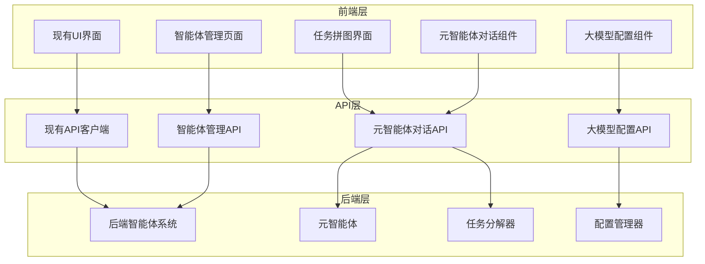

# 前端大模型配置与智能体管理增强设计文档

## 概述

本设计文档详细描述了为现有MVP2前端系统添加大模型配置功能和增强智能体管理界面的技术方案。设计遵循渐进式增强原则，确保新功能不影响现有系统的稳定性和用户体验。

## 架构设计

### 整体架构



### 组件架构

#### 1. 大模型配置管理器 (LLMConfigManager)

```javascript
class LLMConfigManager {
    constructor() {
        this.configs = new Map();
        this.activeConfig = null;
        this.providers = ['siliconflow', 'openai', 'anthropic', 'local'];
    }
    
    // 配置管理方法
    async loadConfigs()
    async saveConfig(config)
    async deleteConfig(configId)
    async testConnection(config)
    async setActiveConfig(configId)
}
```

#### 2. 智能体管理器 (AgentManager)

```javascript
class AgentManager {
    constructor() {
        this.agents = new Map();
        this.statusUpdateHandlers = new Set();
        this.refreshInterval = 30000;
    }
    
    // 智能体管理方法
    async loadAgents()
    async getAgentDetails(agentId)
    async updateAgentConfig(agentId, config)
    async subscribeToUpdates()
    onStatusUpdate(handler)
}
```

#### 3. 元智能体对话管理器 (MetaAgentChatManager)

```javascript
class MetaAgentChatManager {
    constructor() {
        this.conversationId = null;
        this.messages = [];
        this.taskContext = {};
        this.decompositionThreshold = 0.7;
    }
    
    // 对话管理方法
    async startConversation(initialPrompt)
    async sendMessage(message)
    async analyzeComplexity()
    async requestDecomposition()
    async finalizeTask()
}
```

## 组件设计

### 1. 大模型配置界面

#### 界面布局
```html
<div class="llm-config-section">
    <div class="config-header">
        <h3>大模型配置</h3>
        <button class="btn-add-config">添加配置</button>
    </div>
    
    <div class="config-list">
        <!-- 配置项列表 -->
    </div>
    
    <div class="config-form" style="display: none;">
        <!-- 配置表单 -->
    </div>
</div>
```

#### 配置表单字段
- 配置名称
- 提供商选择 (SiliconFlow, OpenAI, Anthropic, 本地部署)
- API密钥 (加密存储)
- 基础URL
- 模型名称
- 温度参数
- 最大令牌数
- 超时设置
- 重试次数

#### 数据模型
```javascript
const LLMConfig = {
    id: String,
    name: String,
    provider: String,
    apiKey: String, // 加密存储
    baseUrl: String,
    model: String,
    temperature: Number,
    maxTokens: Number,
    timeout: Number,
    maxRetries: Number,
    isActive: Boolean,
    createdAt: Date,
    updatedAt: Date
};
```

### 2. 智能体管理页面增强

#### 智能体卡片组件
```html
<div class="agent-card" data-agent-id="{agentId}">
    <div class="agent-header">
        <div class="agent-info">
            <h4 class="agent-name">{name}</h4>
            <span class="agent-type">{type}</span>
        </div>
        <div class="agent-status" data-status="{status}">
            <span class="status-indicator"></span>
            <span class="status-text">{status}</span>
        </div>
    </div>
    
    <div class="agent-description">
        {description}
    </div>
    
    <div class="agent-capabilities">
        <div class="capabilities-list">
            <!-- 能力标签 -->
        </div>
    </div>
    
    <div class="agent-stats">
        <div class="stat-item">
            <span class="stat-label">总执行次数</span>
            <span class="stat-value">{totalExecutions}</span>
        </div>
        <div class="stat-item">
            <span class="stat-label">成功率</span>
            <span class="stat-value">{successRate}%</span>
        </div>
        <div class="stat-item">
            <span class="stat-label">平均耗时</span>
            <span class="stat-value">{avgTime}s</span>
        </div>
    </div>
    
    <div class="agent-actions">
        <button class="btn-view-details">查看详情</button>
        <button class="btn-edit-config">编辑配置</button>
    </div>
</div>
```

#### 智能体详情模态框
```html
<div class="modal agent-detail-modal">
    <div class="modal-content">
        <div class="modal-header">
            <h3>智能体详情</h3>
            <button class="modal-close">&times;</button>
        </div>
        
        <div class="modal-body">
            <div class="detail-tabs">
                <button class="tab-btn active" data-tab="overview">概览</button>
                <button class="tab-btn" data-tab="config">配置</button>
                <button class="tab-btn" data-tab="history">历史记录</button>
                <button class="tab-btn" data-tab="logs">日志</button>
            </div>
            
            <div class="tab-content">
                <!-- 标签页内容 -->
            </div>
        </div>
    </div>
</div>
```

### 3. 任务拼图界面增强

#### 任务创建选择界面
```html
<div class="task-creation-options">
    <div class="creation-option guided-creation">
        <div class="option-icon">
            <i class="icon-robot"></i>
        </div>
        <div class="option-content">
            <h4>智能引导创建</h4>
            <p>通过元智能体对话，获得智能的任务规划建议</p>
        </div>
        <button class="btn-select-option" data-mode="guided">选择此方式</button>
    </div>
    
    <div class="creation-option direct-creation">
        <div class="option-icon">
            <i class="icon-edit"></i>
        </div>
        <div class="option-content">
            <h4>直接创建</h4>
            <p>直接填写任务信息，快速创建任务</p>
        </div>
        <button class="btn-select-option" data-mode="direct">选择此方式</button>
    </div>
</div>
```

#### 元智能体对话界面
```html
<div class="meta-agent-chat">
    <div class="chat-header">
        <div class="agent-info">
            <div class="agent-avatar">
                <i class="icon-robot"></i>
            </div>
            <div class="agent-details">
                <h4>元智能体</h4>
                <span class="agent-status">在线</span>
            </div>
        </div>
        <div class="chat-actions">
            <button class="btn-reset-chat">重新开始</button>
            <button class="btn-close-chat">关闭对话</button>
        </div>
    </div>
    
    <div class="chat-messages">
        <!-- 对话消息 -->
    </div>
    
    <div class="chat-progress">
        <div class="progress-bar">
            <div class="progress-fill" style="width: 0%"></div>
        </div>
        <div class="progress-text">任务信息收集中...</div>
    </div>
    
    <div class="chat-input">
        <textarea placeholder="请输入您的回答..." rows="3"></textarea>
        <div class="input-actions">
            <button class="btn-send">发送</button>
            <button class="btn-decompose" style="display: none;">任务拆解</button>
        </div>
    </div>
</div>
```

#### 任务拆解结果界面
```html
<div class="task-decomposition-result">
    <div class="decomposition-header">
        <h4>任务拆解结果</h4>
        <div class="complexity-score">
            <span class="score-label">复杂度评分:</span>
            <span class="score-value">{complexityScore}</span>
        </div>
    </div>
    
    <div class="main-task">
        <div class="task-item main">
            <div class="task-header">
                <h5>主任务</h5>
                <span class="task-priority">{priority}</span>
            </div>
            <div class="task-content">
                <p class="task-title">{title}</p>
                <p class="task-description">{description}</p>
            </div>
        </div>
    </div>
    
    <div class="subtasks">
        <h5>子任务列表</h5>
        <div class="subtask-list">
            <!-- 子任务项 -->
        </div>
    </div>
    
    <div class="decomposition-actions">
        <button class="btn-edit-tasks">编辑任务</button>
        <button class="btn-confirm-tasks">确认创建</button>
        <button class="btn-regenerate">重新拆解</button>
    </div>
</div>
```

## 数据模型

### 1. 大模型配置模型
```javascript
const LLMConfigModel = {
    id: String,
    name: String,
    provider: String,
    settings: {
        apiKey: String,
        baseUrl: String,
        model: String,
        temperature: Number,
        maxTokens: Number,
        timeout: Number,
        maxRetries: Number
    },
    isActive: Boolean,
    testResult: {
        isValid: Boolean,
        lastTested: Date,
        responseTime: Number,
        errorMessage: String
    },
    usage: {
        totalRequests: Number,
        successfulRequests: Number,
        totalTokens: Number,
        totalCost: Number
    },
    createdAt: Date,
    updatedAt: Date
};
```

### 2. 智能体信息模型
```javascript
const AgentInfoModel = {
    agentId: String,
    agentType: String,
    name: String,
    description: String,
    capabilities: Array,
    status: String,
    currentTask: String,
    configuration: {
        llmConfig: String,
        parameters: Object,
        constraints: Array
    },
    executionStats: {
        totalExecutions: Number,
        successfulExecutions: Number,
        failedExecutions: Number,
        averageExecutionTime: Number,
        lastExecutionTime: Date
    },
    healthStatus: {
        isHealthy: Boolean,
        lastHealthCheck: Date,
        issues: Array
    }
};
```

### 3. 元智能体对话模型
```javascript
const MetaAgentConversationModel = {
    conversationId: String,
    taskContext: {
        title: String,
        description: String,
        requirements: Array,
        constraints: Array,
        complexity: Number,
        estimatedDuration: Number
    },
    messages: Array,
    currentPhase: String,
    progress: Number,
    canDecompose: Boolean,
    decompositionResult: {
        mainTask: Object,
        subtasks: Array,
        dependencies: Array,
        estimatedTotalTime: Number
    },
    createdAt: Date,
    updatedAt: Date
};
```

## 接口设计

### 1. 大模型配置API

#### 获取配置列表
```
GET /api/v1/llm/configs
Response: {
    success: Boolean,
    data: {
        configs: Array<LLMConfig>,
        activeConfigId: String
    }
}
```

#### 创建配置
```
POST /api/v1/llm/configs
Request: {
    name: String,
    provider: String,
    settings: Object
}
Response: {
    success: Boolean,
    data: {
        configId: String
    }
}
```

#### 测试配置
```
POST /api/v1/llm/configs/{configId}/test
Response: {
    success: Boolean,
    data: {
        isValid: Boolean,
        responseTime: Number,
        errorMessage: String
    }
}
```

### 2. 智能体管理API

#### 获取智能体列表
```
GET /api/v1/agents/enhanced
Response: {
    success: Boolean,
    data: {
        agents: Array<AgentInfo>,
        totalCount: Number
    }
}
```

#### 更新智能体配置
```
PUT /api/v1/agents/{agentId}/config
Request: {
    llmConfig: String,
    parameters: Object,
    constraints: Array
}
Response: {
    success: Boolean,
    message: String
}
```

### 3. 元智能体对话API

#### 开始对话
```
POST /api/v1/meta-agent/conversations
Request: {
    initialPrompt: String,
    context: Object
}
Response: {
    success: Boolean,
    data: {
        conversationId: String,
        firstQuestion: String
    }
}
```

#### 发送消息
```
POST /api/v1/meta-agent/conversations/{conversationId}/messages
Request: {
    message: String,
    messageType: String
}
Response: {
    success: Boolean,
    data: {
        response: String,
        progress: Number,
        canDecompose: Boolean,
        nextQuestion: String
    }
}
```

#### 请求任务拆解
```
POST /api/v1/meta-agent/conversations/{conversationId}/decompose
Response: {
    success: Boolean,
    data: {
        mainTask: Object,
        subtasks: Array,
        dependencies: Array,
        complexity: Number
    }
}
```

## 错误处理

### 1. 大模型配置错误
- API密钥无效
- 网络连接失败
- 模型不存在
- 参数验证失败

### 2. 智能体管理错误
- 智能体不可用
- 配置更新失败
- 权限不足
- 状态同步失败

### 3. 元智能体对话错误
- 对话超时
- 上下文丢失
- 任务拆解失败
- 复杂度评估错误

## 测试策略

### 1. 单元测试
- 配置管理器测试
- 智能体管理器测试
- 对话管理器测试
- 数据模型验证测试

### 2. 集成测试
- API接口测试
- WebSocket连接测试
- 数据同步测试
- 错误恢复测试

### 3. 用户界面测试
- 响应式布局测试
- 交互功能测试
- 数据展示测试
- 错误提示测试

### 4. 性能测试
- 页面加载性能
- 实时更新性能
- 大量数据处理
- 并发用户测试

## 安全考虑

### 1. 数据安全
- API密钥加密存储
- 敏感信息脱敏显示
- 安全的数据传输
- 访问权限控制

### 2. 输入验证
- 表单数据验证
- API参数验证
- XSS防护
- CSRF防护

### 3. 错误信息安全
- 不暴露敏感信息
- 统一错误处理
- 日志记录规范
- 异常监控

## 部署考虑

### 1. 渐进式部署
- 功能开关控制
- A/B测试支持
- 回滚机制
- 监控告警

### 2. 兼容性保证
- 浏览器兼容性
- API版本兼容
- 数据格式兼容
- 功能降级方案

### 3. 性能优化
- 代码分割
- 懒加载
- 缓存策略
- CDN部署