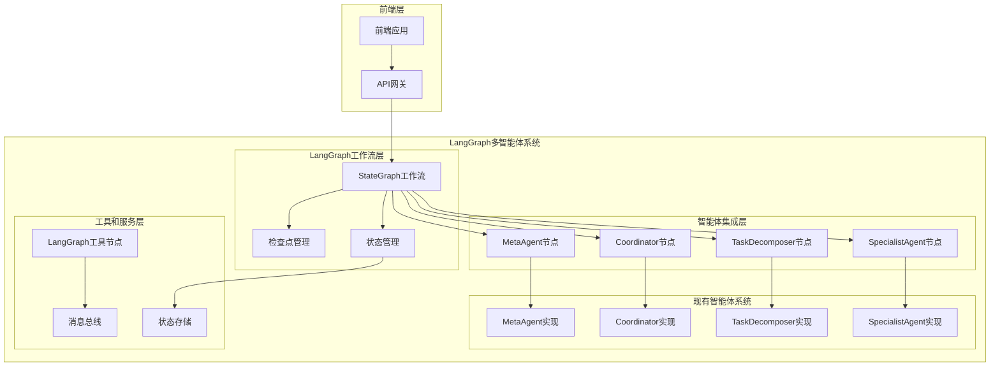
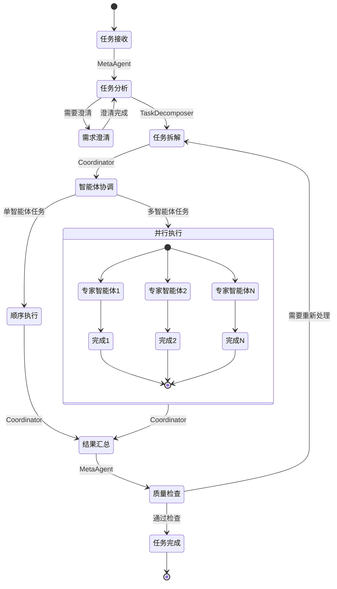

# 设计文档

## 概述

基于LangGraph框架的多智能体系统设计，集成现有的多智能体架构（MetaAgent、Coordinator、TaskDecomposer等），采用LangGraph的StateGraph状态机架构实现智能体间的协作和通信。系统将现有的智能体系统与LangGraph的工作流引擎相结合，提供更强大的任务编排、状态管理和检查点恢复能力，并为前端系统提供统一的API接口。

## 架构

### 整体架构



### LangGraph状态图设计



## 组件和接口

### 1. LangGraph状态定义

**TaskState**: 基于现有TaskState扩展的LangGraph状态

```python
from typing import TypedDict, List, Dict, Any, Optional
from langgraph_multi_agent.state import TaskState as BaseTaskState

class LangGraphTaskState(TypedDict):
    # 继承现有TaskState的所有字段
    task_state: BaseTaskState
    
    # LangGraph特有字段
    current_node: str
    next_nodes: List[str]
    workflow_context: Dict[str, Any]
    checkpoint_data: Optional[Dict[str, Any]]
    
    # 智能体通信
    agent_messages: List[Dict[str, Any]]
    coordination_state: Dict[str, Any]
    
    # 执行控制
    should_continue: bool
    error_state: Optional[Dict[str, Any]]
```

### 2. 智能体节点包装器

**AgentNodeWrapper**: 将现有智能体包装为LangGraph节点

```python
from langgraph.graph import StateGraph
from typing import Dict, Any

class AgentNodeWrapper:
    def __init__(self, agent_instance, agent_type: str):
        self.agent = agent_instance
        self.agent_type = agent_type
    
    async def __call__(self, state: LangGraphTaskState) -> LangGraphTaskState:
        # 从LangGraph状态提取任务数据
        task_data = self._extract_task_data(state)
        
        # 调用现有智能体的process_task方法
        result = await self.agent.process_task(task_data)
        
        # 更新LangGraph状态
        return self._update_state(state, result)
    
    def _extract_task_data(self, state: LangGraphTaskState) -> Dict[str, Any]:
        """从LangGraph状态提取任务数据"""
        return {
            "task_id": state["task_state"]["task_id"],
            "task_type": self.agent_type,
            "input_data": state["task_state"]["input_data"],
            "context": state["workflow_context"]
        }
    
    def _update_state(self, state: LangGraphTaskState, result: Dict[str, Any]) -> LangGraphTaskState:
        """更新LangGraph状态"""
        # 更新任务状态
        state["task_state"]["output_data"] = result
        state["task_state"]["updated_at"] = datetime.now()
        
        # 更新工作流上下文
        state["workflow_context"][f"{self.agent_type}_result"] = result
        
        # 记录智能体消息
        state["agent_messages"].append({
            "agent_type": self.agent_type,
            "timestamp": datetime.now(),
            "result": result
        })
        
        return state
```

### 3. 工作流编排器

**MultiAgentWorkflow**: 主要的LangGraph工作流

```python
from langgraph.graph import StateGraph, END
from langgraph.checkpoint.memory import MemorySaver

class MultiAgentWorkflow:
    def __init__(self, existing_agents: Dict[str, Any]):
        self.agents = existing_agents
        self.workflow = self._build_workflow()
        self.checkpointer = MemorySaver()
    
    def _build_workflow(self) -> StateGraph:
        workflow = StateGraph(LangGraphTaskState)
        
        # 添加智能体节点
        workflow.add_node("meta_agent", 
                         AgentNodeWrapper(self.agents["meta_agent"], "meta_analysis"))
        workflow.add_node("coordinator", 
                         AgentNodeWrapper(self.agents["coordinator"], "coordination"))
        workflow.add_node("task_decomposer", 
                         AgentNodeWrapper(self.agents["task_decomposer"], "decomposition"))
        
        # 添加条件边
        workflow.add_conditional_edges(
            "meta_agent",
            self._should_decompose,
            {
                "decompose": "task_decomposer",
                "coordinate": "coordinator",
                "end": END
            }
        )
        
        workflow.add_conditional_edges(
            "task_decomposer",
            self._should_coordinate,
            {
                "coordinate": "coordinator",
                "end": END
            }
        )
        
        workflow.add_edge("coordinator", END)
        
        # 设置入口点
        workflow.set_entry_point("meta_agent")
        
        return workflow.compile(checkpointer=self.checkpointer)
    
    def _should_decompose(self, state: LangGraphTaskState) -> str:
        """决定是否需要任务拆解"""
        meta_result = state["workflow_context"].get("meta_analysis_result", {})
        if meta_result.get("complexity_score", 0) > 0.6:
            return "decompose"
        elif meta_result.get("requires_coordination", False):
            return "coordinate"
        else:
            return "end"
    
    def _should_coordinate(self, state: LangGraphTaskState) -> str:
        """决定是否需要协调"""
        decomp_result = state["workflow_context"].get("decomposition_result", {})
        if len(decomp_result.get("subtasks", [])) > 1:
            return "coordinate"
        else:
            return "end"
```

### 4. 前端API接口

**LangGraphAPI**: 基于FastAPI的接口层

```python
from fastapi import FastAPI, HTTPException
from pydantic import BaseModel
from typing import Dict, Any, Optional

app = FastAPI(title="LangGraph Multi-Agent System")

class TaskRequest(BaseModel):
    title: str
    description: str
    task_type: str = "general"
    priority: int = 1
    input_data: Optional[Dict[str, Any]] = None

class TaskResponse(BaseModel):
    task_id: str
    status: str
    result: Optional[Dict[str, Any]] = None
    checkpoint_id: Optional[str] = None

@app.post("/api/v1/tasks", response_model=TaskResponse)
async def create_task(request: TaskRequest):
    """创建新任务"""
    try:
        # 创建初始状态
        initial_state = LangGraphTaskState(
            task_state=TaskState.create_new(
                title=request.title,
                description=request.description,
                task_type=request.task_type,
                priority=request.priority,
                input_data=request.input_data
            ),
            current_node="meta_agent",
            next_nodes=[],
            workflow_context={},
            checkpoint_data=None,
            agent_messages=[],
            coordination_state={},
            should_continue=True,
            error_state=None
        )
        
        # 执行工作流
        workflow = MultiAgentWorkflow(existing_agents)
        result = await workflow.workflow.ainvoke(
            initial_state,
            config={"thread_id": initial_state["task_state"]["task_id"]}
        )
        
        return TaskResponse(
            task_id=result["task_state"]["task_id"],
            status=result["task_state"]["status"],
            result=result["task_state"]["output_data"],
            checkpoint_id=result.get("checkpoint_data", {}).get("checkpoint_id")
        )
        
    except Exception as e:
        raise HTTPException(status_code=500, detail=str(e))

@app.get("/api/v1/tasks/{task_id}", response_model=TaskResponse)
async def get_task(task_id: str):
    """获取任务状态"""
    try:
        # 从检查点恢复状态
        workflow = MultiAgentWorkflow(existing_agents)
        state = await workflow.workflow.aget_state(
            config={"thread_id": task_id}
        )
        
        return TaskResponse(
            task_id=task_id,
            status=state.values["task_state"]["status"],
            result=state.values["task_state"]["output_data"],
            checkpoint_id=state.config.get("checkpoint_id")
        )
        
    except Exception as e:
        raise HTTPException(status_code=404, detail="Task not found")

@app.post("/api/v1/tasks/{task_id}/resume")
async def resume_task(task_id: str):
    """恢复暂停的任务"""
    try:
        workflow = MultiAgentWorkflow(existing_agents)
        result = await workflow.workflow.ainvoke(
            None,  # 从检查点恢复
            config={"thread_id": task_id}
        )
        
        return TaskResponse(
            task_id=task_id,
            status=result["task_state"]["status"],
            result=result["task_state"]["output_data"]
        )
        
    except Exception as e:
        raise HTTPException(status_code=500, detail=str(e))
```

## 数据模型

### 扩展的状态模型

基于现有的TaskState，添加LangGraph特有的字段：

```python
from langgraph_multi_agent.state import TaskState, TaskStatus
from typing import TypedDict, List, Dict, Any, Optional
from datetime import datetime

class WorkflowContext(TypedDict):
    """工作流上下文"""
    current_phase: str
    completed_phases: List[str]
    agent_results: Dict[str, Any]
    coordination_plan: Optional[Dict[str, Any]]
    execution_metadata: Dict[str, Any]

class CheckpointData(TypedDict):
    """检查点数据"""
    checkpoint_id: str
    created_at: datetime
    workflow_state: str
    resumable: bool
    metadata: Dict[str, Any]

class AgentMessage(TypedDict):
    """智能体消息"""
    message_id: str
    sender_agent: str
    receiver_agent: Optional[str]
    message_type: str
    content: Dict[str, Any]
    timestamp: datetime
```

## 错误处理和恢复

### 1. 检查点机制

利用LangGraph的内置检查点功能：

```python
from langgraph.checkpoint.memory import MemorySaver
from langgraph.checkpoint.sqlite import SqliteSaver

class CheckpointManager:
    def __init__(self, storage_type: str = "memory"):
        if storage_type == "sqlite":
            self.checkpointer = SqliteSaver.from_conn_string("checkpoints.db")
        else:
            self.checkpointer = MemorySaver()
    
    async def save_checkpoint(self, thread_id: str, state: LangGraphTaskState):
        """保存检查点"""
        config = {"thread_id": thread_id}
        await self.checkpointer.aput(config, state)
    
    async def load_checkpoint(self, thread_id: str) -> Optional[LangGraphTaskState]:
        """加载检查点"""
        config = {"thread_id": thread_id}
        checkpoint = await self.checkpointer.aget(config)
        return checkpoint.values if checkpoint else None
```

### 2. 错误恢复策略

```python
class ErrorRecoveryHandler:
    def __init__(self, max_retries: int = 3):
        self.max_retries = max_retries
    
    async def handle_agent_error(self, 
                                state: LangGraphTaskState, 
                                error: Exception,
                                agent_type: str) -> LangGraphTaskState:
        """处理智能体错误"""
        retry_count = state.get("retry_count", 0)
        
        if retry_count < self.max_retries:
            # 增加重试计数
            state["retry_count"] = retry_count + 1
            state["error_state"] = {
                "error_type": type(error).__name__,
                "error_message": str(error),
                "failed_agent": agent_type,
                "retry_count": retry_count + 1
            }
            # 返回到前一个节点重试
            return state
        else:
            # 超过最大重试次数，标记为失败
            state["task_state"]["status"] = TaskStatus.FAILED
            state["should_continue"] = False
            return state
```

## 测试策略

### 1. 单元测试

测试各个组件的独立功能：

```python
import pytest
from unittest.mock import Mock, AsyncMock

class TestAgentNodeWrapper:
    @pytest.fixture
    def mock_agent(self):
        agent = Mock()
        agent.process_task = AsyncMock(return_value={"success": True, "result": "test"})
        return agent
    
    @pytest.fixture
    def sample_state(self):
        return LangGraphTaskState(
            task_state=TaskState.create_new("Test Task", "Test Description"),
            current_node="test_node",
            next_nodes=[],
            workflow_context={},
            checkpoint_data=None,
            agent_messages=[],
            coordination_state={},
            should_continue=True,
            error_state=None
        )
    
    async def test_agent_wrapper_call(self, mock_agent, sample_state):
        wrapper = AgentNodeWrapper(mock_agent, "test_agent")
        result_state = await wrapper(sample_state)
        
        assert result_state["workflow_context"]["test_agent_result"]["success"] is True
        mock_agent.process_task.assert_called_once()
```

### 2. 集成测试

测试LangGraph工作流的端到端执行：

```python
class TestMultiAgentWorkflow:
    @pytest.fixture
    def mock_agents(self):
        return {
            "meta_agent": Mock(),
            "coordinator": Mock(),
            "task_decomposer": Mock()
        }
    
    async def test_workflow_execution(self, mock_agents):
        workflow = MultiAgentWorkflow(mock_agents)
        
        initial_state = LangGraphTaskState(...)
        result = await workflow.workflow.ainvoke(initial_state)
        
        assert result["task_state"]["status"] == TaskStatus.COMPLETED
        assert "meta_analysis_result" in result["workflow_context"]
```

### 3. 性能测试

测试系统在高负载下的表现：

```python
import asyncio
import time

class TestPerformance:
    async def test_concurrent_tasks(self):
        """测试并发任务处理能力"""
        workflow = MultiAgentWorkflow(existing_agents)
        
        tasks = []
        start_time = time.time()
        
        for i in range(100):
            task = workflow.workflow.ainvoke(
                create_test_state(f"Task {i}"),
                config={"thread_id": f"task_{i}"}
            )
            tasks.append(task)
        
        results = await asyncio.gather(*tasks)
        end_time = time.time()
        
        assert len(results) == 100
        assert end_time - start_time < 60  # 应在60秒内完成
```

## 部署和扩展

### 1. 容器化部署

```dockerfile
FROM python:3.11-slim

WORKDIR /app

COPY requirements.txt .
RUN pip install -r requirements.txt

COPY . .

EXPOSE 8000

CMD ["uvicorn", "main:app", "--host", "0.0.0.0", "--port", "8000"]
```

### 2. Kubernetes配置

```yaml
apiVersion: apps/v1
kind: Deployment
metadata:
  name: langgraph-multi-agent
spec:
  replicas: 3
  selector:
    matchLabels:
      app: langgraph-multi-agent
  template:
    metadata:
      labels:
        app: langgraph-multi-agent
    spec:
      containers:
      - name: app
        image: langgraph-multi-agent:latest
        ports:
        - containerPort: 8000
        env:
        - name: DATABASE_URL
          value: "sqlite:///checkpoints.db"
        resources:
          requests:
            memory: "512Mi"
            cpu: "250m"
          limits:
            memory: "1Gi"
            cpu: "500m"
```

### 3. 监控和日志

```python
import logging
from langsmith import Client
from langgraph.pregel import Pregel

# 配置LangSmith追踪
langsmith_client = Client()

class MonitoredWorkflow(MultiAgentWorkflow):
    def __init__(self, *args, **kwargs):
        super().__init__(*args, **kwargs)
        self.logger = logging.getLogger(__name__)
    
    async def execute_with_monitoring(self, initial_state: LangGraphTaskState):
        """带监控的工作流执行"""
        with langsmith_client.trace("multi_agent_workflow") as trace:
            try:
                result = await self.workflow.ainvoke(initial_state)
                trace.end(outputs={"status": "success", "result": result})
                return result
            except Exception as e:
                trace.end(outputs={"status": "error", "error": str(e)})
                self.logger.error(f"Workflow execution failed: {e}")
                raise
```

这个设计文档展示了如何将现有的多智能体系统与LangGraph框架集成，保持现有功能的同时，利用LangGraph的强大特性来增强系统的可靠性、可扩展性和可维护性。